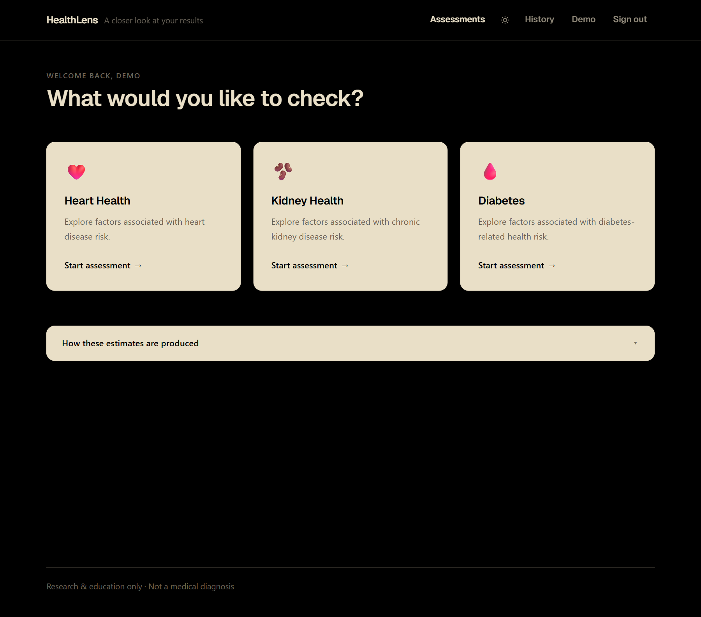
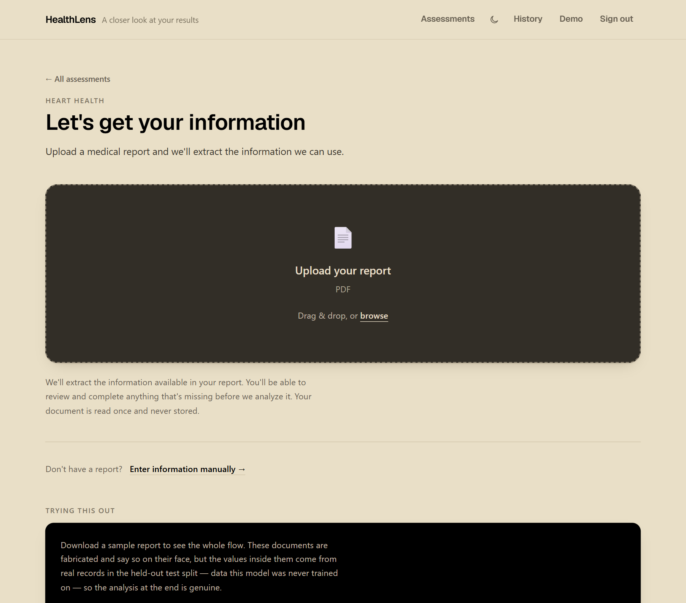
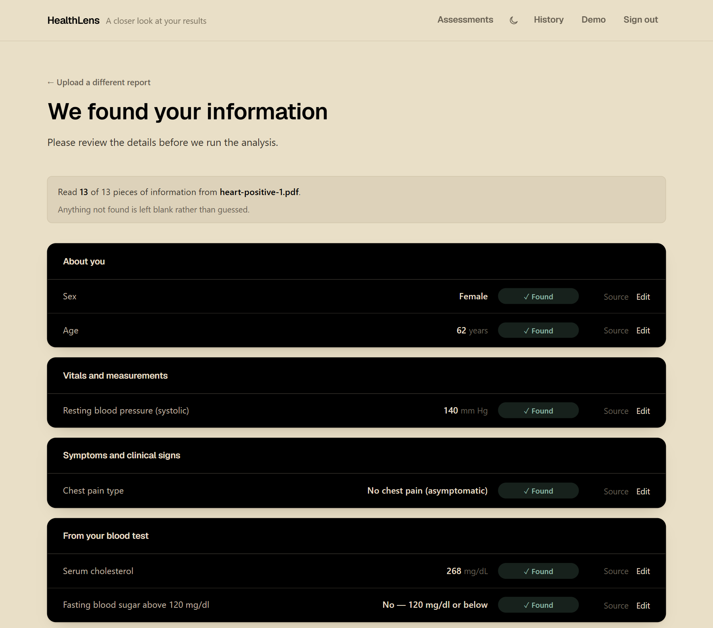
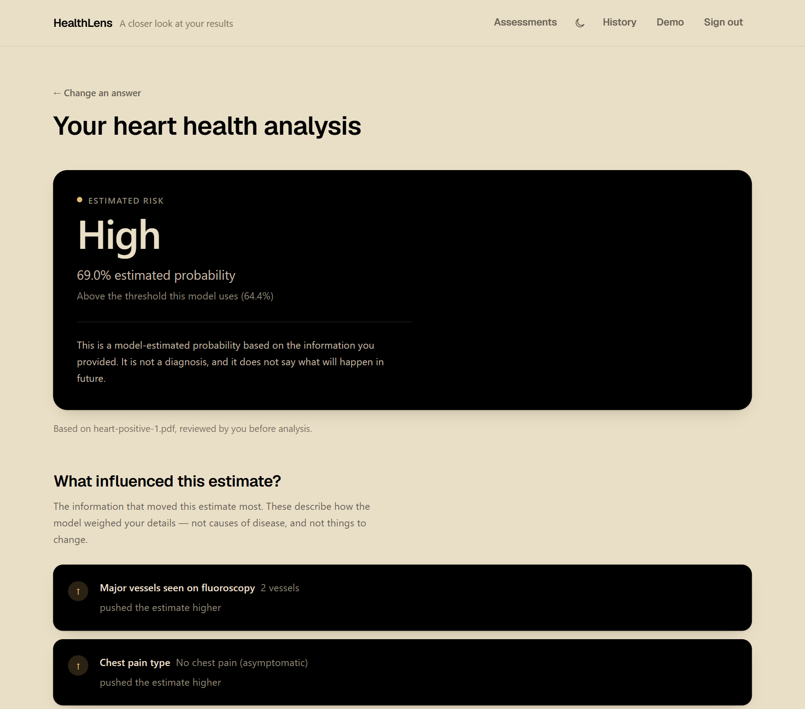
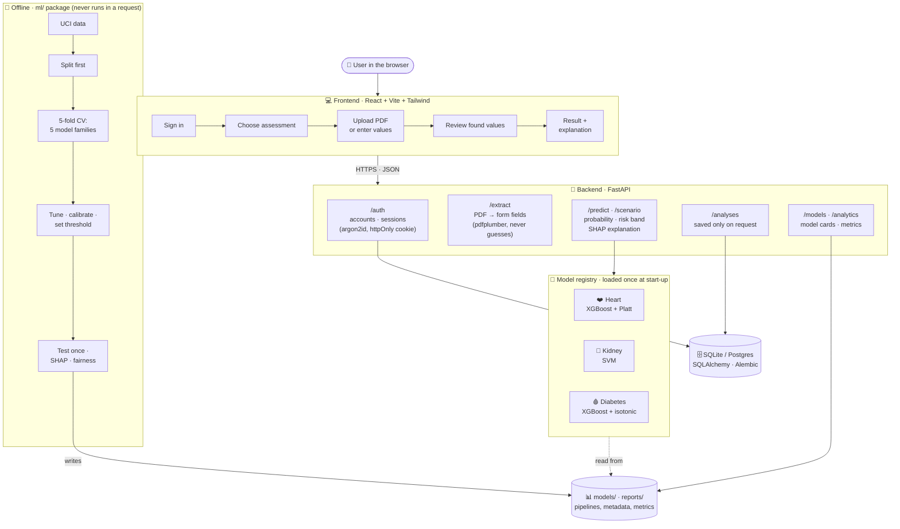

# HealthLens

**Explainable machine-learning risk prediction for heart disease, chronic kidney disease
and diabetes, built on public datasets.** Upload a health report or fill in a short form,
and see what stands out, in everyday language. The project and its code are named
*Multi-Disease AI*; HealthLens is the web app.

> **For research and educational purposes only.** Predictions come from models trained on
> historical public datasets and must **not** be read as a medical diagnosis or medical
> advice.

## Screenshots

<p align="center">
  <br>
  <sub>Landing page</sub>
</p>

<table>
  <tr>
    <td width="50%"></td>
    <td width="50%"></td>
  </tr>
  <tr>
    <td align="center"><sub>1 · Choose an assessment (dark mode)</sub></td>
    <td align="center"><sub>2 · Upload a report, or enter values by hand</sub></td>
  </tr>
  <tr>
    <td width="50%"></td>
    <td width="50%"></td>
  </tr>
  <tr>
    <td align="center"><sub>3 · Review what was read from the report</sub></td>
    <td align="center"><sub>4 · The estimate, and what drove it</sub></td>
  </tr>
</table>

<sub>Shown with <code>demo_reports/heart-positive-1.pdf</code>, a sample report built from a held-out test record.</sub>

## Modules

Three **independent** pipelines, each with its own dataset, preprocessing, model
comparison, evaluation and explanations. Their predictions are **never** combined into one
"overall health score".

| Module | Dataset | Target |
|---|---|---|
| Heart Disease Presence | UCI Heart Disease (Cleveland), id 45 | angiographic disease present (`num > 0`) |
| Chronic Kidney Disease Presence | UCI Chronic Kidney Disease, id 336 | `class == 'ckd'` |
| Diabetes Health-Indicator Risk | UCI CDC Diabetes Health Indicators (BRFSS 2015), id 891 | reported prediabetes or diabetes |

## Architecture



Each disease is its own pipeline end to end: its own data, preprocessing, model, threshold
and model card. The three predictions are never combined.

**How an assessment runs:** the user uploads a report → `/extract` reads what it can and
leaves the rest blank → the user reviews and fills gaps → `/predict/{disease}` scores it with
that disease's pipeline, compares it to the model's own threshold and attaches the SHAP
explanation → the result is shown, and saved only if the user chooses to.

## Good to know

- **Sign-in is required.** Every assessment, upload and report needs an account. Health
  values are stored only when you choose to save them. See [docs/AUTH.md](docs/AUTH.md).
- **Every number is real.** All metrics come from actual training runs (`RANDOM_STATE = 42`);
  none are placeholders. Each model's uses and limits are in `models/<disease>/MODEL_CARD.md`.
- **No external validation.** Heart's intended external cohort (Statlog, UCI 145) turned out
  to be a copy of rows already in Cleveland, so it was rejected. All performance figures come
  from one held-out split of one dataset.
- **Explanations come with every result.** SHAP shows which values pushed the estimate higher
  or lower, mapped back to the original field names.

## Repository layout

```
📦 medicl
├── 🧠 ml/                    the machine-learning package
│   ├── data/                 dataset download, caching, loaders, validation
│   ├── eda/                  profiling and plots
│   ├── preprocessing/        leakage-safe pipeline per disease
│   ├── training/             model zoo, search spaces, experiment runners
│   ├── evaluation/           metrics, curves, calibration
│   ├── explainability/       SHAP, global and per-prediction
│   ├── fairness/             subgroup analysis
│   ├── external/             the Heart → Statlog validation attempt
│   ├── extraction/           PDF report → form fields (never invents a value)
│   ├── reports/              sample reports and the downloadable result PDF
│   └── serving/              labels, units and field groups the app shows
│
├── 🔌 backend/               FastAPI service: routes, schemas, accounts, sessions
├── 💻 frontend/              React + Vite + Tailwind web app (HealthLens)
│
├── 📊 models/<disease>/      model cards, metadata and serving files
├── 📈 reports/<disease>/     EDA, metrics, figures
├── 📓 notebooks/             walkthrough notebooks (read results, never retrain)
├── 🧾 demo_reports/          synthetic sample PDFs to try the upload flow
├── 🔧 scripts/               training and export entry points
├── 📜 migrations/            database schema (Alembic)
├── ✅ tests/                 structure, leakage and shipped-model tests
│
├── 📚 docs/                  API.md · FRONTEND.md · AUTH.md · screenshots/
└── config.py                 seed, paths, disease registry, disclaimer
```

## Setup

```bash
python -m venv .venv
# Windows: .venv\Scripts\Activate.ps1   ·   macOS / Linux: source .venv/bin/activate
python -m pip install -r requirements.txt
python -m alembic upgrade head          # creates the accounts database
```

Copy `.env.example` to `.env` only if you want to change a setting; every value has a
development default.

## Run the web app

```bash
uvicorn backend.main:app --reload       # backend on port 8000
npm --prefix frontend install
npm --prefix frontend run dev           # app on http://localhost:5173
```

Pick an assessment, upload a report (or enter values by hand), review what was found, then
see the result and what drove it. Sample reports are on the first screen. More in
[docs/FRONTEND.md](docs/FRONTEND.md).

## Methodology

- **No data leakage.** Data is split before anything is fitted; all imputation, scaling and
  resampling happen inside the pipeline and cross-validation folds.
- **No choices made on the test set.** Model, hyper-parameters, calibration and decision
  threshold are all picked on training folds.
- **Close results are reported as close.** None of the three models won decisively (margins of
  0.0005, 0.0002 and 0.0003 cross-validated ROC-AUC), and every model card says so.
- **The API can't invent a number.** It serves the saved training results, and no model is
  trained while handling a request.
- **Outliers are flagged, not dropped**, because medical measurements can be genuinely extreme.
- **The three diseases stay separate**: their own data, preprocessing, models and model cards.
