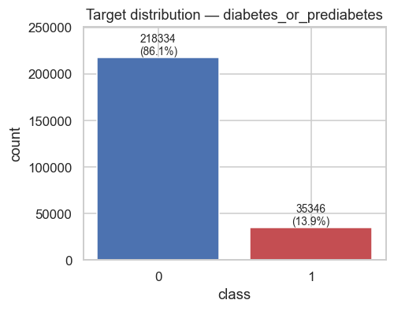
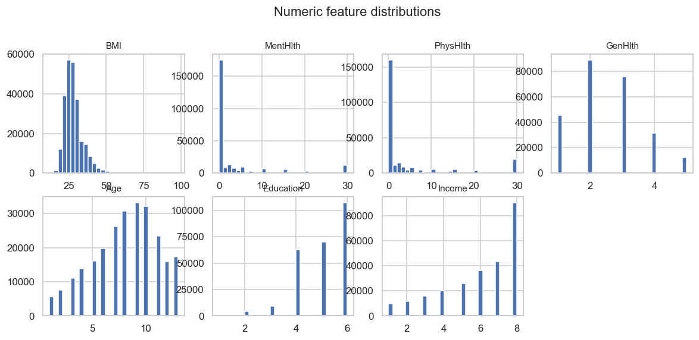
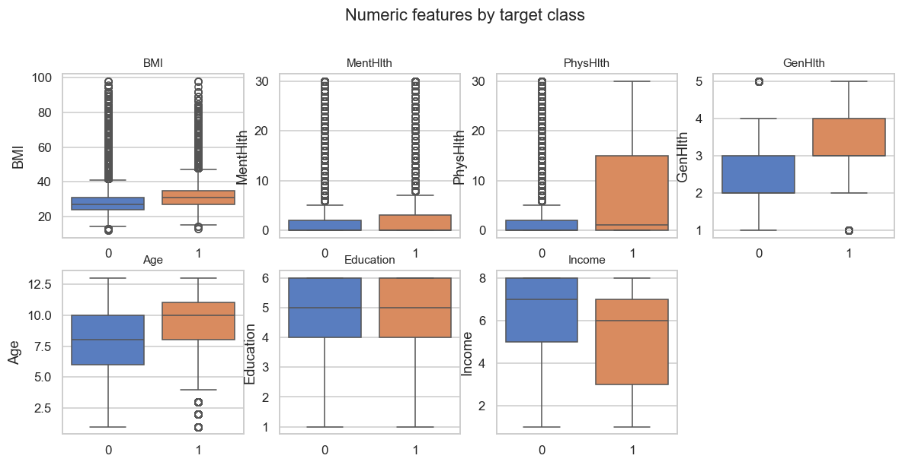
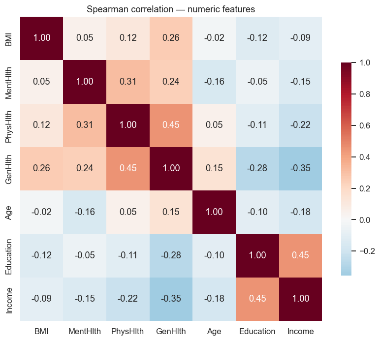
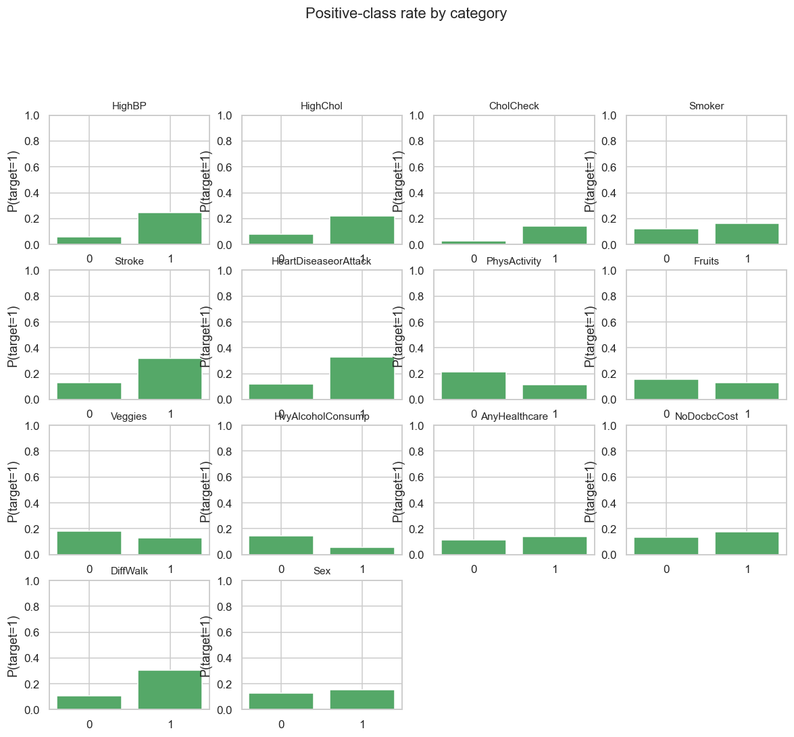

# Exploratory Data Analysis — Diabetes Health-Indicator Risk Prediction

- Rows: **253680**  |  Features: **21** (7 numeric, 0 categorical, 14 binary)
- Duplicate rows: 25772
- Rows with any missing value: 0 (0.0%)
- Total missing cells: 0

## Target distribution

| class | count | proportion |
|---|---|---|
| 0 | 218334 | 0.8607 |
| 1 | 35346 | 0.1393 |

Class-imbalance ratio (majority / minority): **6.18**

## Missing values

No missing values in any predictor column.

## Top |correlation| of numeric features with the target (descriptive only)

| feature | corr with target |
|---|---|
| `GenHlth` | +0.294 |
| `BMI` | +0.217 |
| `Age` | +0.177 |
| `PhysHlth` | +0.171 |
| `Income` | -0.164 |
| `Education` | -0.124 |
| `MentHlth` | +0.069 |

## Figures

## Outlier scan (IQR fences — diagnostic only, nothing removed)

See `eda_profile.json -> outlier_scan`. Medical measurements legitimately contain extreme values; outliers are flagged, not dropped.

---
*Generated by `python -m ml.eda.run`. Re-run after any loader change.*