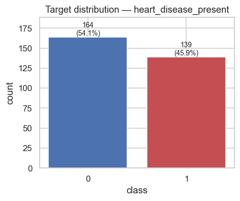
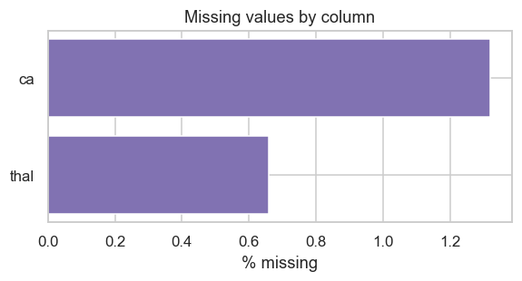
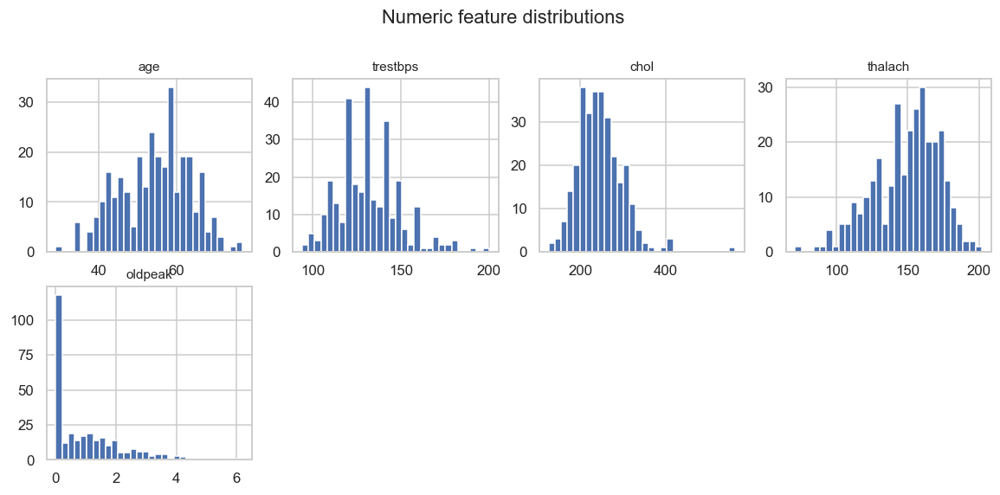
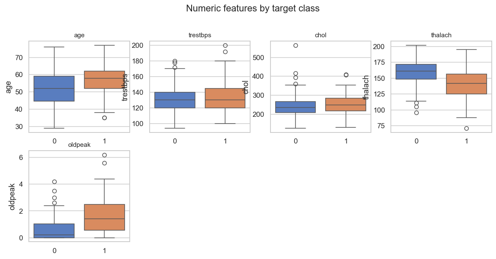
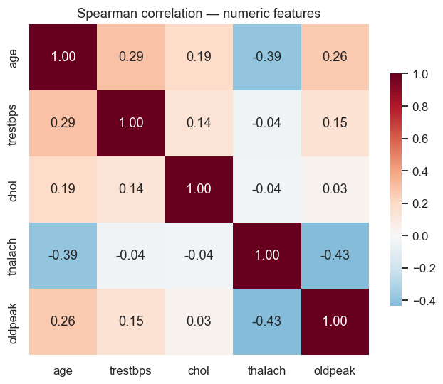
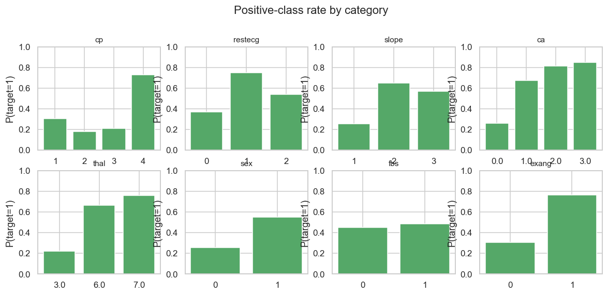

# Exploratory Data Analysis — Heart Disease Presence Prediction

- Rows: **303**  |  Features: **13** (5 numeric, 5 categorical, 3 binary)
- Duplicate rows: 0
- Rows with any missing value: 6 (2.0%)
- Total missing cells: 6

## Target distribution

| class | count | proportion |
|---|---|---|
| 0 | 164 | 0.5413 |
| 1 | 139 | 0.4587 |

Class-imbalance ratio (majority / minority): **1.18**

## Missing values

| column | dtype | n_missing | pct_missing |
|---|---|---|---|
| `ca` | float64 | 4 | 1.32% |
| `thal` | float64 | 2 | 0.66% |

## Top |correlation| of numeric features with the target (descriptive only)

| feature | corr with target |
|---|---|
| `oldpeak` | +0.425 |
| `thalach` | -0.417 |
| `age` | +0.223 |
| `trestbps` | +0.151 |
| `chol` | +0.085 |

## Figures

## Outlier scan (IQR fences — diagnostic only, nothing removed)

See `eda_profile.json -> outlier_scan`. Medical measurements legitimately contain extreme values; outliers are flagged, not dropped.

---
*Generated by `python -m ml.eda.run`. Re-run after any loader change.*