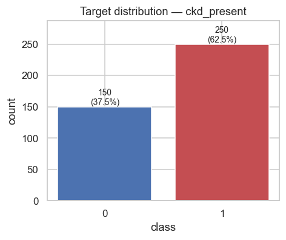
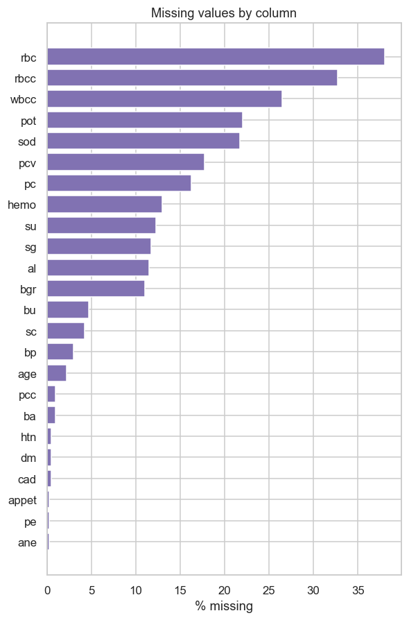
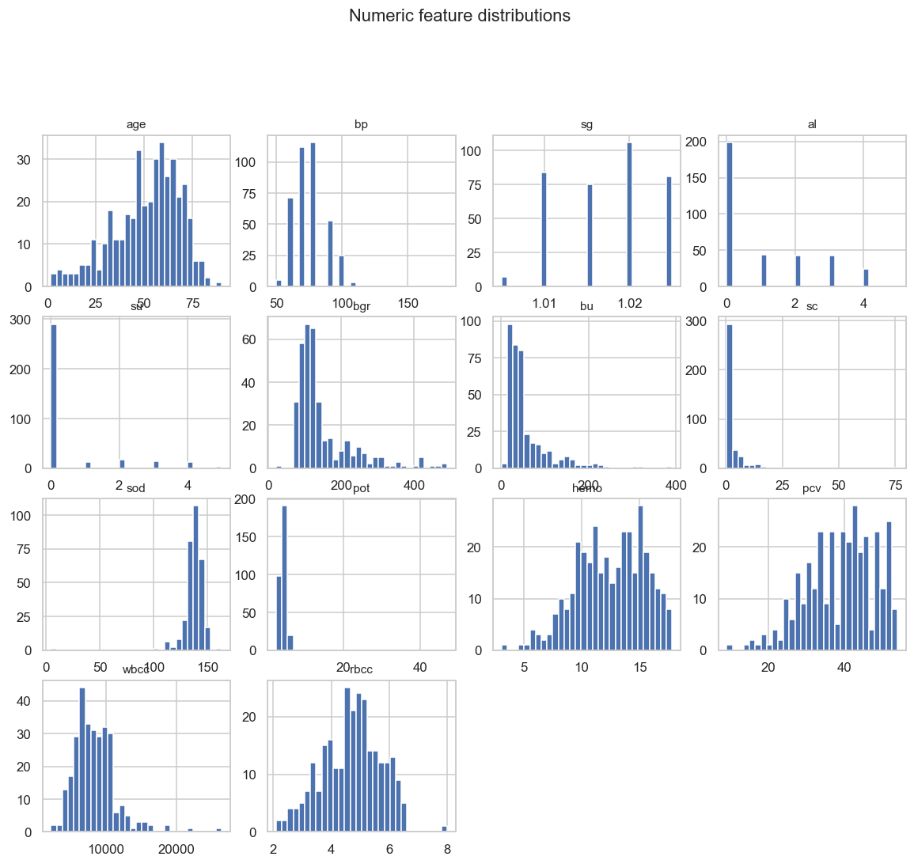
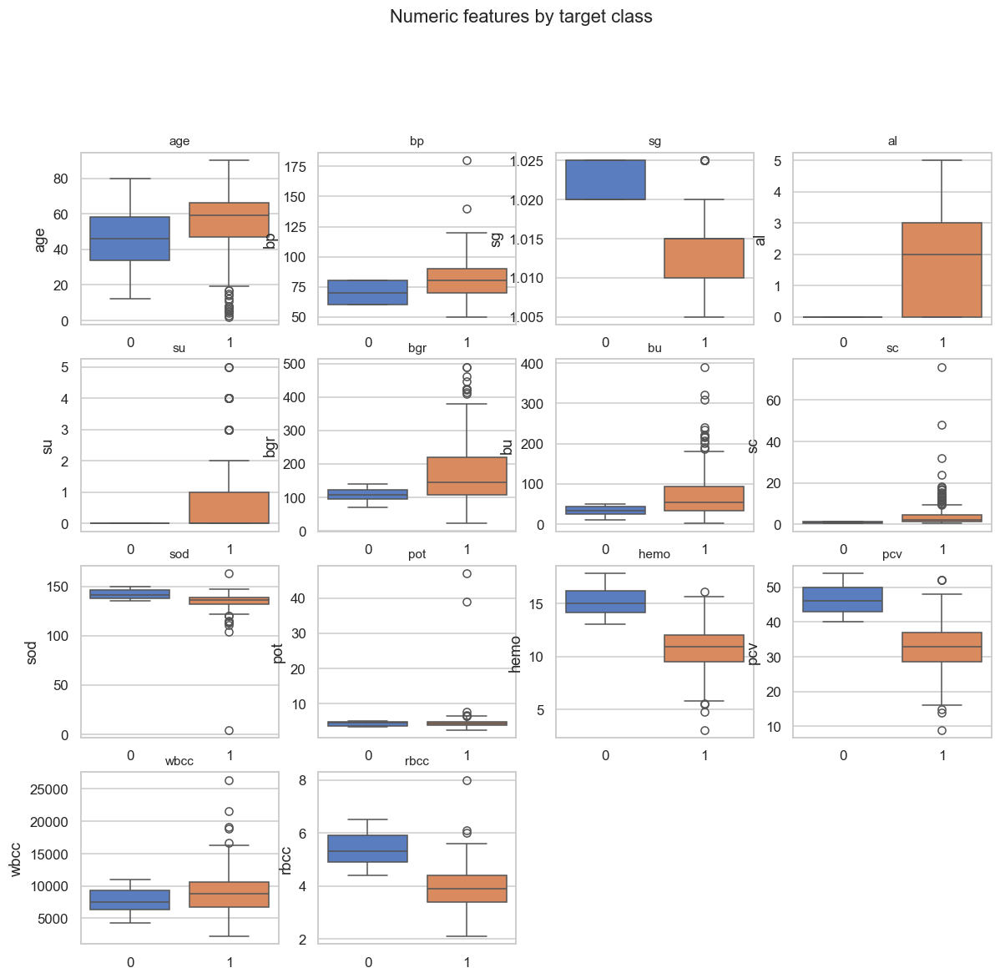
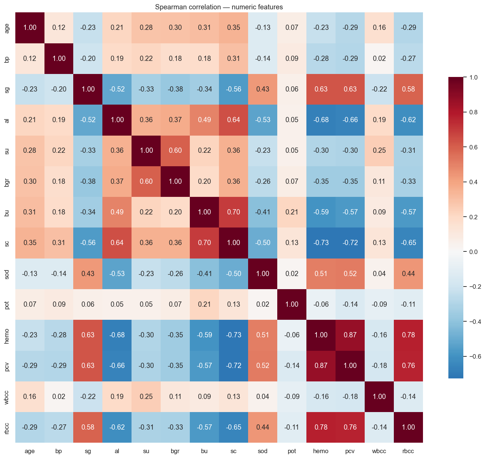
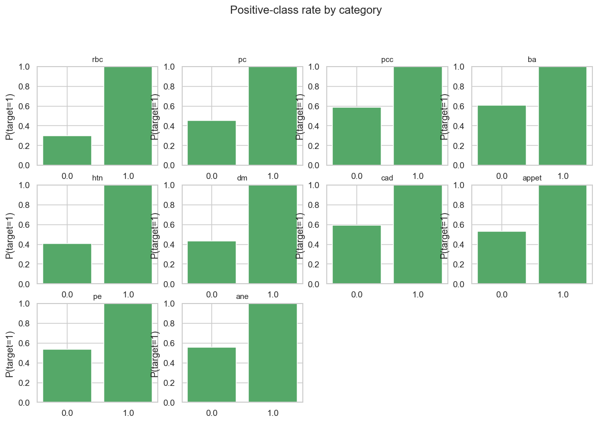

# Exploratory Data Analysis — Chronic Kidney Disease Presence Prediction

- Rows: **400**  |  Features: **24** (14 numeric, 0 categorical, 10 binary)
- Duplicate rows: 0
- Rows with any missing value: 242 (60.5%)
- Total missing cells: 1012

## Target distribution

| class | count | proportion |
|---|---|---|
| 0 | 150 | 0.3750 |
| 1 | 250 | 0.6250 |

Class-imbalance ratio (majority / minority): **1.67**

## Missing values

| column | dtype | n_missing | pct_missing |
|---|---|---|---|
| `rbc` | float64 | 152 | 38.0% |
| `rbcc` | float64 | 131 | 32.75% |
| `wbcc` | float64 | 106 | 26.5% |
| `pot` | float64 | 88 | 22.0% |
| `sod` | float64 | 87 | 21.75% |
| `pcv` | float64 | 71 | 17.75% |
| `pc` | float64 | 65 | 16.25% |
| `hemo` | float64 | 52 | 13.0% |
| `su` | float64 | 49 | 12.25% |
| `sg` | float64 | 47 | 11.75% |
| `al` | float64 | 46 | 11.5% |
| `bgr` | float64 | 44 | 11.0% |
| `bu` | float64 | 19 | 4.75% |
| `sc` | float64 | 17 | 4.25% |
| `bp` | float64 | 12 | 3.0% |
| `age` | float64 | 9 | 2.25% |
| `pcc` | float64 | 4 | 1.0% |
| `ba` | float64 | 4 | 1.0% |
| `htn` | float64 | 2 | 0.5% |
| `dm` | float64 | 2 | 0.5% |
| `cad` | float64 | 2 | 0.5% |
| `appet` | float64 | 1 | 0.25% |
| `pe` | float64 | 1 | 0.25% |
| `ane` | float64 | 1 | 0.25% |

## Top |correlation| of numeric features with the target (descriptive only)

| feature | corr with target |
|---|---|
| `hemo` | -0.769 |
| `pcv` | -0.741 |
| `sg` | -0.732 |
| `rbcc` | -0.699 |
| `al` | +0.627 |
| `bgr` | +0.420 |
| `bu` | +0.381 |
| `sod` | -0.376 |
| `su` | +0.344 |
| `sc` | +0.300 |

## Figures

## Outlier scan (IQR fences — diagnostic only, nothing removed)

See `eda_profile.json -> outlier_scan`. Medical measurements legitimately contain extreme values; outliers are flagged, not dropped.

---
*Generated by `python -m ml.eda.run`. Re-run after any loader change.*